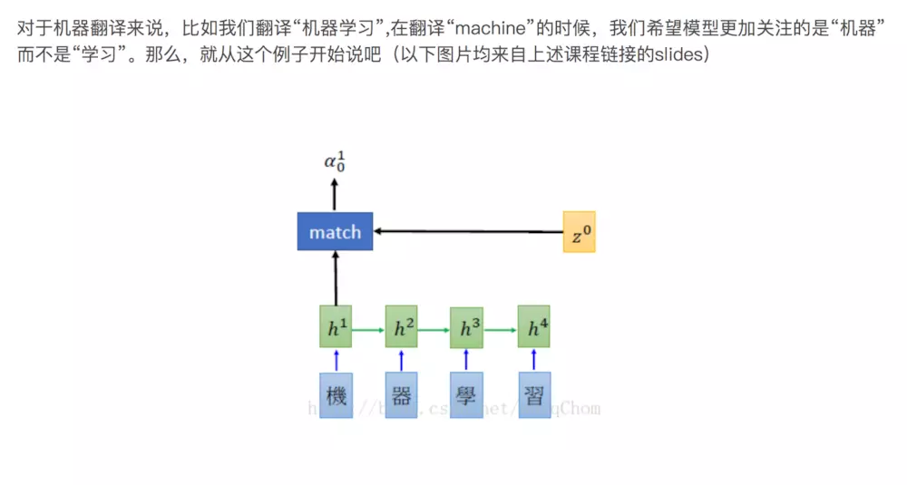
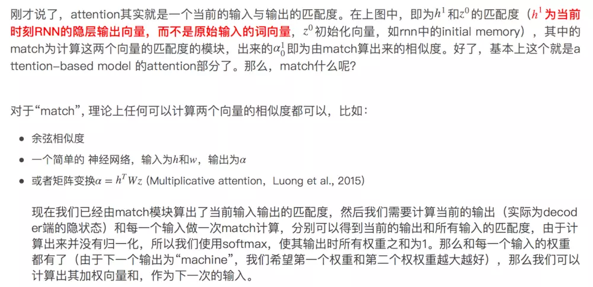
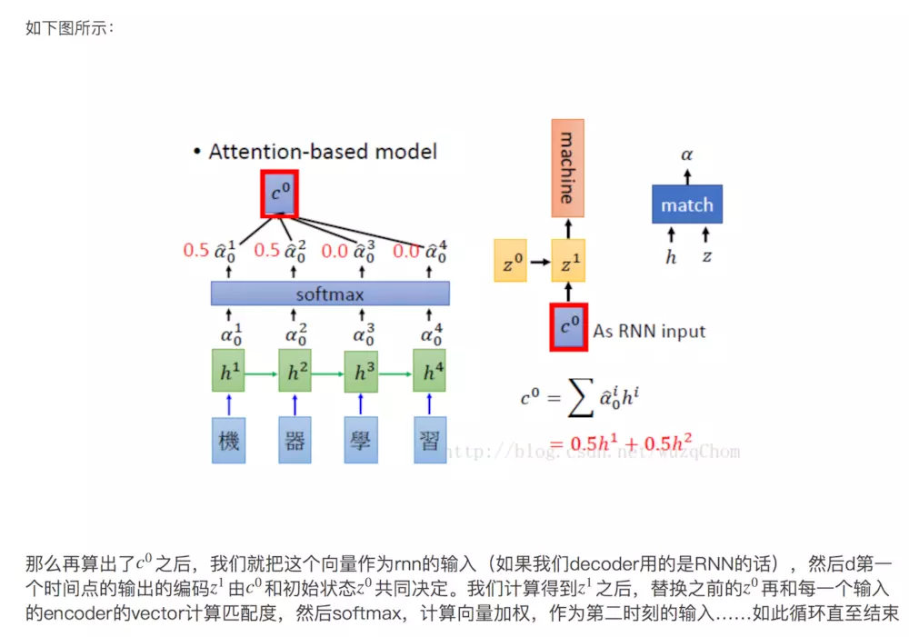
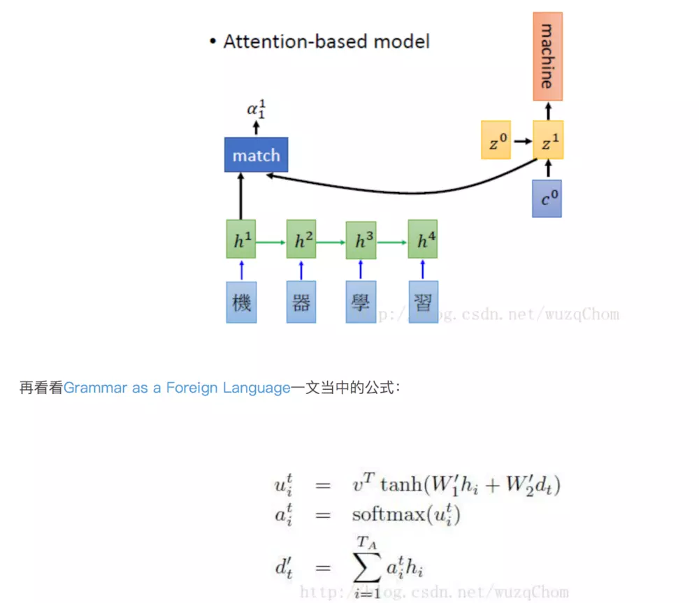
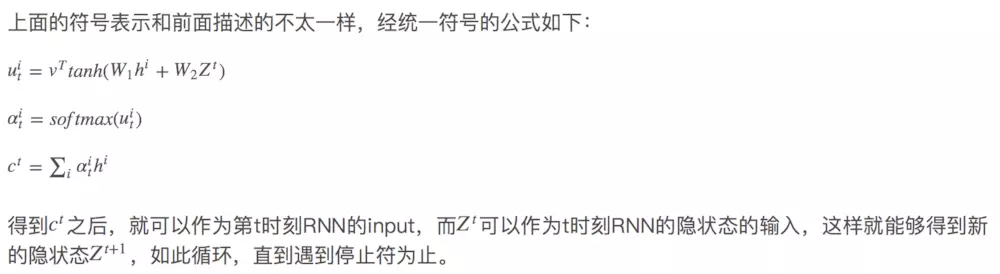
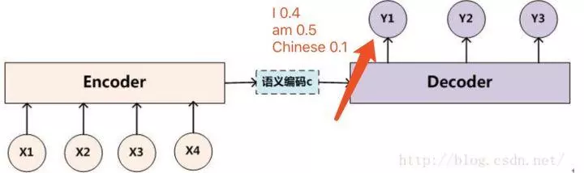
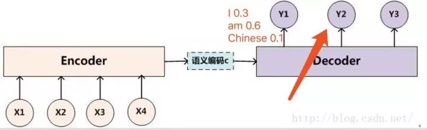
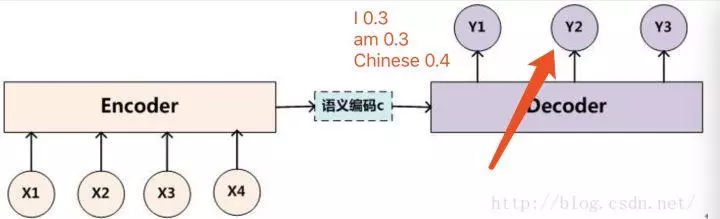

# seq2seq-nmt

使用 Sequence to Sequence Learing（Seq2Seq）实现神经机器翻译（Neural Machine Translation，NMT）。

## 知识点

- LSTM
- GRU
- Attention 机制
- Tensorflow
- beam search
- bleu 指标
- perplexity

## TensorFlow API

- tf.nn.bidirectional_dynamic_rnn
- tf.get_variable
- tf.concat
- tf.contrib.seq2seq.tile_batch
- tf.contrib.seq2seq.LuongAttention
- tf.contrib.seq2seq.BahdanauAttention
- tf.contrib.seq2seq.AttentionWrapper
- tf.fill
- tf.contrib.seq2seq.BeamSearchDecoder
- tf.contrib.seq2seq.dynamic_decode
- tf.contrib.seq2seq.TrainingHelper
- tf.contrib.seq2seq.BasicDecoder
- tf.transpose
- tf.nn.sparse_softmax_cross_entropy_with_logits
- tf.reduce_sum

## tqdm

tqdm 是一个快速、可扩展的Python进度条，可以在 Python 长循环中添加一个进度提示信息，用户只需要封装任意的迭代器 tqdm(iterator) 即可。

## 为什么要有attention机制
原本的Seq2seq模型只有一个encoder和一个decoder，通常的做法是将一个输入的句子编码成一个固定大小的state，然后作为decoder的初始状态（当然也可以作为每一时刻的输入），但这样的一个状态对于decoder中的所有时刻都是一样的。
attention即为注意力，人脑在对于的不同部分的注意力是不同的。需要attention的原因是非常直观的，当我们看一张照片时，照片上有一个人，我们的注意力会集中在这个人身上，而它身边的花草蓝天，可能就不会得到太多的注意力。也就是说，普通的模型可以看成所有部分的attention都是一样的，而这里的attention-based model对于不同的部分，重要的程度则不同，decoder中每一个时刻的状态是不同的。

## Attention-based Model是什么
Attention-based Model其实就是一个相似性的度量，当前的输入与目标状态越相似，那么在当前的输入的权重就会越大，说明当前的输出越依赖于当前的输入。严格来说，Attention并算不上是一种新的model，而仅仅是在以往的模型中加入attention的思想，所以Attention-based Model或者Attention Mechanism是比较合理的叫法，而非Attention Model。
没有attention机制的encoder-decoder结构通常把encoder的最后一个状态作为decoder的输入（可能作为初始化，也可能作为每一时刻的输入），但是encoder的state毕竟是有限的，存储不了太多的信息，对于decoder过程，每一个步骤都和之前的输入都没有关系了，只与这个传入的state有关。attention机制的引入之后，decoder根据时刻的不同，让每一时刻的输入都有所不同。

## Attention 原理

## beam search 介绍

在sequence2sequence模型中，beam search的方法只用在测试的情况，因为在训练过程中，每一个decoder的输出是有正确答案的，也就不需要beam search去加大输出的准确率。

假设现在我们用机器翻译作为例子来说明，我们需要翻译中文“我是中国人”--->英文“I am Chinese”，假设我们的词表大小只有三个单词就是I am Chinese。那么如果我们的beam size为2的话，我们现在来解释,如下图所示，我们在decoder的过程中，有了beam search方法后，在第一次的输出，我们选取概率最大的"I"和"am"两个单词，而不是只挑选一个概率最大的单词。

然后接下来我们要做的就是，把“I”单词作为下一个decoder的输入算一遍得到y2的输出概率分布，把“am”单词作为下一个decoder的输入算一遍也得到y2的输出概率分布。比如将“I”单词作为下一个decoder的输入算一遍得到y2的输出概率分布如下：

比如将“am”单词作为下一个decoder的输入算一遍得到y2的输出概率分布如下：

那么此时我们由于我们的beam size为2，也就是我们只能保留概率最大的两个序列，此时我们可以计算所有的序列概率：“I I” = 0.40.3 "I am" = 0.40.6 "I Chinese" = 0.4*0.1 "am I" = 0.50.3 "am am" = 0.50.3 "am Chinese" = 0.5*0.4 我们很容易得出俩个最大概率的序列为 “I am”和“am Chinese”，然后后面会不断重复这个过程，直到遇到结束符为止。最终输出2个得分最高的序列。这就是seq2seq中的beam search算法过程，

## 参考

- 《深度有趣》
- [使用Seq2Seq+attention model实现简单的Chatbot](https://www.jianshu.com/p/aab40f439012)

